# Overview

The initial analysis for the school district was performed by utilizing the provided [schools_complete.csv](Resources/schools_complete.csv) and [clean_students_complete.csv](Resources/clean_students_complete.csv) files. However, the analysis had to be redone once it was discovered that there was proof of academic dishonesty for the reading and math grades for Thomas High School ninth graders. The altered ninth grade data was removed in the updated analysis.

# Results

- After removing the ninth graders' math and reading scores for Thomas High School: Average math score, Passing math percentage, Passing reading percentage, and Overall passing percentage scores have decreased.
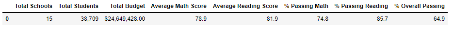

**Old Result:**
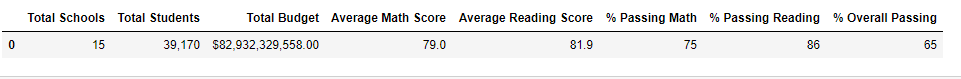

- After removing the ninth graders' math and reading scores for Thomas High School: the Average math score, Average reading score, Passing math percentage, Passing reading percentage, and Overall passing percentage have decreased.
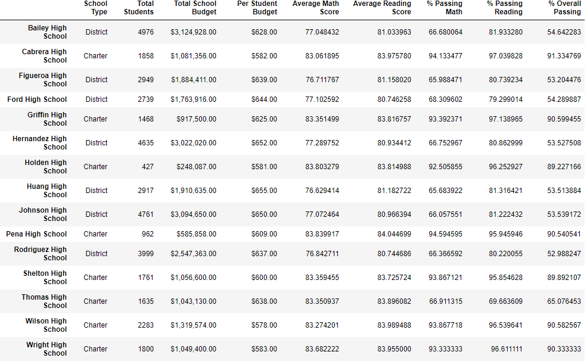

**Old Result:**
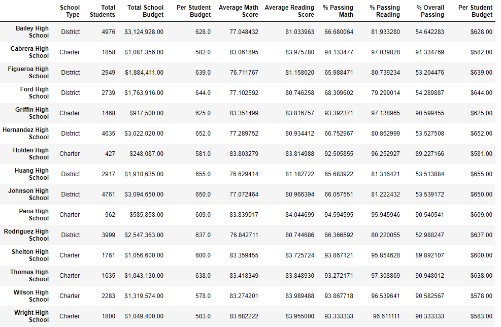

- After removing the ninth graders' math and reading scores Thomas High School is no longer in the top five because the overall passing percentage has decreased.
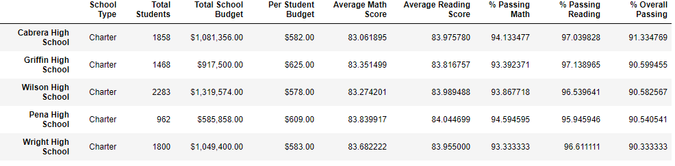

**Old Result:**
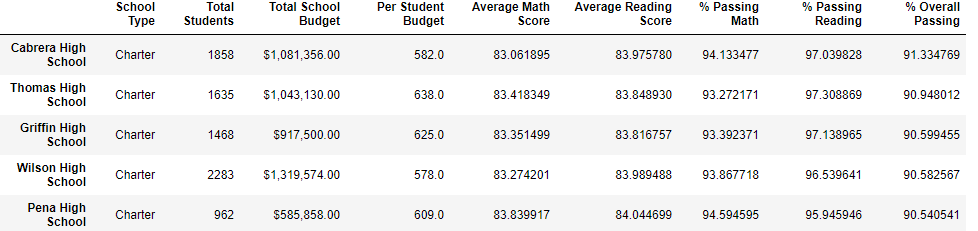

- Thomas High School has no grade ninth-grade scores for math and reading. 
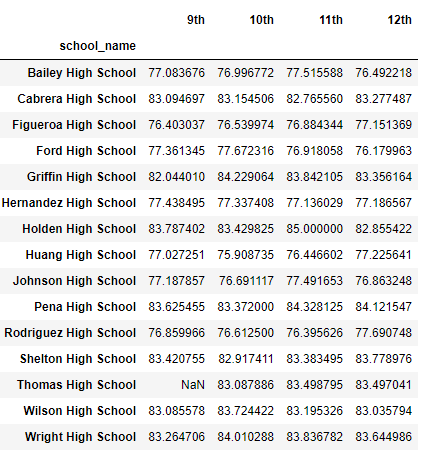

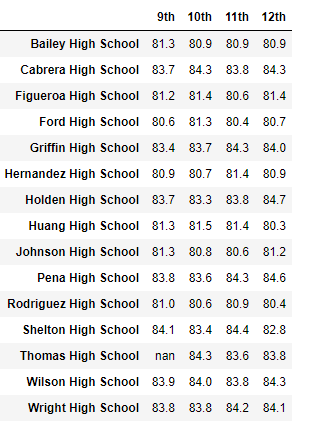

- Spending range per student for $630-644 has decreased for  Passing math percentage, Passing reading percentage, and Overall passing percentage.
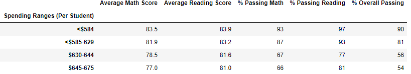

**Old Result:**
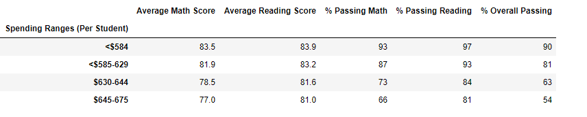

- For medium (1000-2000 students) size schools the Passing math percentage, Passing reading percentage, and Overall passing percentage have decreased.
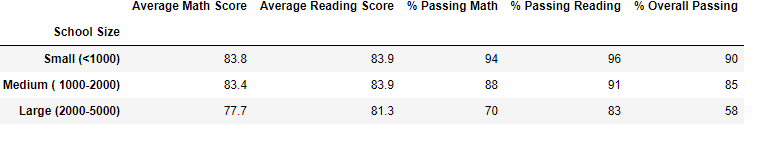

**Old Result:**
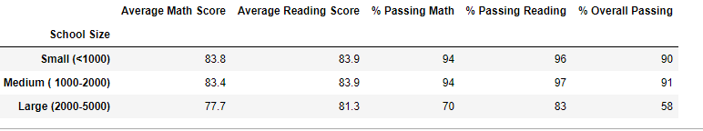

- For Charter schools has decreased for  Passing math percentage, Passing reading percentage, and Overall passing percentage.
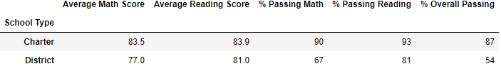

**Old Result:**
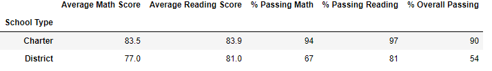

# Summary

1. Thomas High School is no longer in the top five based on the overall passing percentage.
2. The spending range per student for $630-644 has decreased.
3. For medium (1000-2000 students) size schools the Passing math percentage, Passing reading percentage, and Overall passing percentage have decreased.
4. For Charter schools, the Passing math percentage, Passing reading percentage, and Overall passing percentage have decreased.
